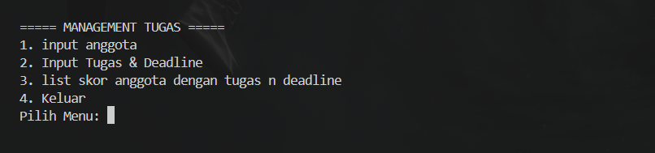
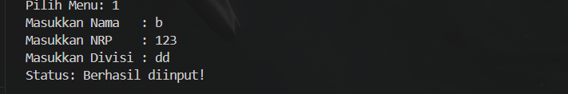
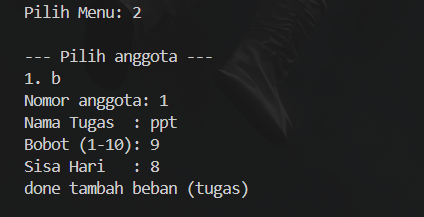
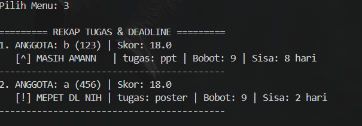
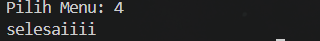

# KALKULATOR TUGAS 
JAVA - PBO Barra Ahza Fakhrullah 023
## deskripsi kasus
> Dalam sebuah organisasi/kepanitiaan atau bahkan sekedar kelompok belajar kecil biasanya terdapat perbedaan tugas yang dikerjakan oleh masing masing individu hal tersebut bisanya menjadi pemicu ketimpangan tugas yang dapat dirasakan oleh beberapa anggota kelompok itu sendiri, maka dari itu code ini bertujuan untuk memanage dan menghitung bobot tugas dari masing masing anggota yang dilengkapi dengan pengingat deadline dengan trigger sisa hari.
## class diagram

## kode java 
```java

package tugasjava;
import java.util.Scanner;


class Tugas {
    String namaTugas;
    int bobot;
    int sisaHari;

    public Tugas(String nama, int bbt, int hari) {
        this.namaTugas = nama;
        this.bobot = bbt;
        this.sisaHari = hari;
    }
}


abstract class Orang {
    protected String nrp, nama, divisi;
    public Orang(String nama, String nrp, String divisi) {
        this.nama = nama;
        this.nrp = nrp;
        this.divisi = divisi;
    }
    public abstract void tampilkanProfil();
}


abstract class Evaluator extends Orang {
    public Evaluator(String nama, String nrp, String divisi) {
        super(nama, nrp, divisi);
    }
    public abstract double hitungSkorPerforma();
}


class Staff extends Evaluator {
    private Tugas[] daftarTugas = new Tugas[5]; 
    private int jumlahTugas = 0;

    public Staff(String nama, String nrp, String divisi) {
        super(nama, nrp, divisi);
    }

    public void tambahTugas(String nama, int bbt, int hari) {
        if (jumlahTugas < 5) {
          
            daftarTugas[jumlahTugas] = new Tugas(nama, bbt, hari);
            jumlahTugas++;
            System.out.println("done tambah beban (tugas)");
        } else {
            System.out.println("kebanyakan tugas woii");
        }
    }

    public void lihatRincianTugas() {
        if (jumlahTugas == 0) {
            System.out.println("   (Belum ada tugas)");
        } else {
            for (int i = 0; i < jumlahTugas; i++) {
                Tugas t = daftarTugas[i]; 
                String status = (t.sisaHari <= 3) ? "[!] MEPET DL NIH " : "[^] MASIH AMANN   ";
                System.out.println("   " + status + t.namaTugas + " | Bobot: " + t.bobot + " | Sisa: " + t.sisaHari + " hari");
            }
        }
    }

    @Override
    public double hitungSkorPerforma() {
        int totalBobot = 0;
        for (int i = 0; i < jumlahTugas; i++) {
            totalBobot += daftarTugas[i].bobot;
        }
        return totalBobot * 2;
    }

    @Override
    public void tampilkanProfil() {
        System.out.println("ANGGOTA: " + nama + " (" + nrp + ") | Skor: " + hitungSkorPerforma());
    }
}

public class KalkulatorTugas {
    public static void main(String[] args) {
        Scanner sc = new Scanner(System.in);
        Staff[] kumpulanStaff = new Staff[10];
        int totalStaff = 0;

        while (true) {
            System.out.println("\n===== MANAGEMENT TUGAS =====");
            System.out.println("1. input anggota");
            System.out.println("2. Input Tugas & Deadline");
            System.out.println("3. list skor anggota dengan tugas n deadline");
            System.out.println("4. Keluar");
            System.out.print("Pilih Menu: ");
            int pil = sc.nextInt(); sc.nextLine();

            if (pil == 1) {
                if (totalStaff < 10) {
                    System.out.print("Masukkan Nama   : "); 
                    String nama = sc.nextLine();
                    System.out.print("Masukkan NRP    : "); 
                    String nrp = sc.nextLine();
                    System.out.print("Masukkan Divisi : "); 
                    String div = sc.nextLine();
                    kumpulanStaff[totalStaff] = new Staff(nama, nrp, div);
                    totalStaff++;
                    System.out.println("Status: Berhasil diinput!");
                }
            } else if (pil == 2) {
                if (totalStaff == 0) { System.out.println("Belum ada data anggota"); continue; }

                System.out.println("\n--- Pilih anggota ---");
                for (int i = 0; i < totalStaff; i++) System.out.println((i + 1) + ". " + kumpulanStaff[i].nama);
                System.out.print("Nomor anggota: ");
                int target = sc.nextInt() - 1; sc.nextLine();

                if (target >= 0 && target < totalStaff) {
                    System.out.print("Nama Tugas  : "); 
                    String tgs = sc.nextLine();
                    System.out.print("Bobot (1-10): "); 
                    int bbt = sc.nextInt();
                    System.out.print("Sisa Hari   : "); 
                    int hari = sc.nextInt();
                    kumpulanStaff[target].tambahTugas(tgs, bbt, hari);
                }
            } else if (pil == 3) {
                if (totalStaff == 0) { System.out.println("gaada apa-apa nih"); continue; }

                System.out.println("\n========= REKAP TUGAS & DEADLINE =========");
                for (int i = 0; i < totalStaff; i++) {
                    System.out.print((i + 1) + ". ");
                    kumpulanStaff[i].tampilkanProfil();
                    kumpulanStaff[i].lihatRincianTugas();
                    System.out.println("------------------------------------------");
                }
            } else if (pil == 4) {
                System.out.println("selesaiiii");
                break;
            }
        }
        sc.close();
    }
}
```
## OUTPUT
`MENU`



`OPSI 1`



`OPSI 2`



`OPSI 3`



`OPSI 4`



## prinsip oop
**ABSTRACTION**

Karena `tampilkanProfil()` dan `hitungSkorPerforma()` dideklarasikan abstract, `Staff` wajib override keduanya. agar `opsi 3` selalu bisa manggil kedua method tersebut tanpa takut error karena dari awal sudah dipaksa ada.
``` java
abstract class Orang {
    public abstract void tampilkanProfil(); // slot kosong, wajib diisi
}

abstract class Evaluator extends Orang {
    public abstract double hitungSkorPerforma(); // slot kosong, wajib diisi
}

class Staff extends Evaluator {
    @Override
    public double hitungSkorPerforma() { ... } // Staff ngisi slot ini

    @Override
    public void tampilkanProfil() { ... } // Staff ngisi slot ini
}
 ```
**INHERITANCE**

`Staff` ga perlu deklarasi ulang `nama`, `nrp`, `divisi` karena udah diwarisi dari `Orang` lewat `Evaluator`. Hal ini dilakukan agar waktu user input anggota di `opsi 1`, data langsung tersimpan dan bisa langsung dipake di `opsi 2`  dan `opsi 3` 

``` java
abstract class Orang {
    protected String nrp, nama, divisi;
    public Orang(String nama, String nrp, String divisi) {
        this.nama = nama;
        this.nrp = nrp;
        this.divisi = divisi;
    }
}

abstract class Evaluator extends Orang {
    public Evaluator(String nama, String nrp, String divisi) {
        super(nama, nrp, divisi);
    }
}

class Staff extends Evaluator {
    public Staff(String nama, String nrp, String divisi) {
        super(nama, nrp, divisi); // nama, nrp, divisi ngalir dari Staff → Evaluator → Orang
    }
}
```
**ENCAPSULATION**

`daftarTugas` dan `jumlahTugas` dibuat private, jadi satu-satunya cara nambahin `tugas` adalah lewat method `tambahTugas()`. Hal ini dilakukan agar validasi `if (jumlahTugas < 5)` pasti selalu jalan ga ada celah tugas ke 6 nyusup masuk tanpa dicek, dan pesan `"kebanyakan tugas woii"` pasti muncul kalau udah penuh.

``` java
private Tugas[] daftarTugas = new Tugas[5];
private int jumlahTugas = 0;

public void tambahTugas(String nama, int bbt, int hari) {
    if (jumlahTugas < 5) {
        daftarTugas[jumlahTugas] = new Tugas(nama, bbt, hari);
        jumlahTugas++;
        System.out.println("done tambah beban (tugas)");
    } else {
        System.out.println("kebanyakan tugas woii");
    }
}
```
**POLYMORPHISM**

`hitungSkorPerforma()` dan `tampilkanProfil()` keduanya di-override di `Staff`. Hal ini dilakukan agar tiap kali `opsi 3` dibuka, `skor` dan `profil` yang tampil dihitung dari data tugas masing-masing `staff `
``` java
class Staff extends Evaluator {
........
@Override
public double hitungSkorPerforma() {
    int totalBobot = 0;
    for (int i = 0; i < jumlahTugas; i++) {
        totalBobot += daftarTugas[i].bobot; // akumulasi bobot tugas staff ini
    }
    return totalBobot * 2;
}

@Override
public void tampilkanProfil() {
    System.out.println("ANGGOTA: " + nama + " (" + nrp + ") | Skor: " + hitungSkorPerforma());
} }
```
